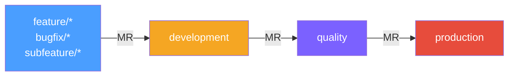
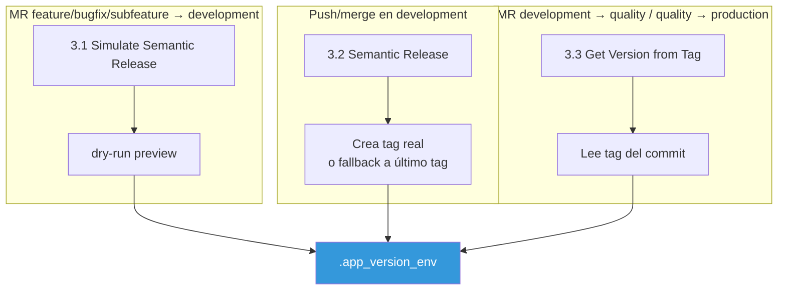
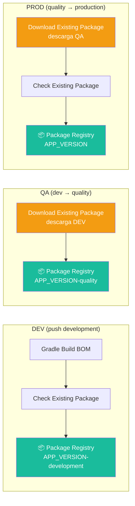
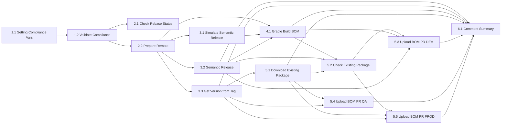

# Pipeline Android – Native BOM (GitLab CI)

Pipeline GitLab CI para el proyecto `cl-android-native-bom` (BOM de dependencias third-party y AndroidX). Gestiona compilación Gradle del BOM, versionado semántico, y publicación a Package Registry. A diferencia del Itaú BOM, este pipeline construye el artefacto una sola vez en DEV y lo promueve a QA y PROD descargando el paquete ya publicado.

Archivo de entrada: `.mobile-android-native-bom.yml`

---

## Flujo de ramas



- Tags no disparan el pipeline.
- Push/merge en `development` también dispara el pipeline (sin contexto MR) para ejecutar Semantic Release real y publicar a Package Registry DEV.
- MR fuera de este flujo no matchean ninguna regla del workflow y el pipeline no se ejecuta.

---

## Modelo de promoción de artefactos

Este pipeline sigue un modelo de "build once, promote":


- El BOM se construye una sola vez durante el flujo DEV.
- Para QA y PROD, el job `Download Existing Package` descarga el artefacto ya publicado en el entorno anterior y lo re-publica con el sufijo correspondiente.

---

## Stages


Los jobs usan `needs:` para formar un DAG y maximizar paralelismo.

---

## Includes

### Archivos locales (shared)

| Archivo | Propósito |
|---|---|
| `files/shared/calculate_version.yml` | Cálculo de versión y semantic release |
| `files/shared/check_rebase.yml` | Validación de rebase y conflictos |
| `files/shared/comment_summary.yml` | Comentario resumen en MR |
| `files/shared/package_registry.yml` | Helpers para verificar y descargar paquetes existentes |
| `files/shared/reusable_commands.yml` | Helpers: git auth, downloads, comentarios MR |
| `files/shared/rules_components.yml` | Anchors de reglas por tipo de MR/branch |

### Componente externo

`componente-package-registry/uploadv2@main` para uploads a Package Registry (3 instancias: DEV, QA, PROD).

---

## Stage: compliance

Gate obligatorio que valida políticas organizacionales antes de continuar.

### 1.1 Setting Compliance Variables
Genera `compliance.env` (dotenv) con:
- `COMPLIANCE_TECNOLOGY=mobile`
- `COMPLIANCE_LANGUAGES=$CI_PROJECT_REPOSITORY_LANGUAGES`
- `COMPLIANCE_PROJECT=$CI_PROJECT_PATH`

### 1.2 Validate Compliance
Dispara un pipeline downstream en `arq-devops-team/pipelines-gitlab/rule-validation` (rama `main`) con `strategy: depend`. El pipeline padre espera el resultado.

Variables enviadas al downstream:
- Las 3 de compliance (vía `forward: yaml_variables` + `pipeline_variables`).
- `REPO_ID=$CI_PROJECT_ID`

---

## Stage: prepare_pipeline

### 2.1 Check Rebase Status
Valida el estado del MR: comenta MR no válidos, verifica conflictos y si la rama source está desfasada respecto al target. Solo se ejecuta en MR feature/bugfix/subfeature → development.

### 2.2 Prepare Remote
Descarga e instala Python y PyYAML, lee `ci/config.yaml` del proyecto y genera `build.env` (dotenv) con variables de configuración:

- `GRADLE_VERSION` (default: `8.8`)
- `TEMURIN_VERSION` (default: `21`)
- `PIPELINE_ID`

Si `ci/config.yaml` no existe, el job falla con error explícito. Todos los jobs posteriores consumen `build.env` vía dotenv artifacts.

---

## Stage: calculate_version



| Job | Descripción | Cuándo |
|---|---|---|
| 3.1 Simulate Semantic Release | `semantic-release --dry-run` para previsualizar versión. Publica `APP_VERSION`, `VERSION_NAME` en `.app_version_env` | MR feature/bugfix/subfeature → development |
| 3.2 Semantic Release | Ejecuta semantic-release real (crea tag). Si no produce versión, hace fallback al último Git tag. Publica `.app_version_env` | Push/merge en development |
| 3.3 Get Version from Tag | Obtiene versión desde tag del commit actual. Publica `APP_VERSION` en `.app_version_env` | MR development → quality, quality → production |

---

## Stage: build

A diferencia del pipeline Itaú BOM (que tiene un job de build por entorno), el Native BOM tiene un único job de build que solo corre en el flujo DEV.

### 4.1 Gradle Build BOM
1. Carga `build.env` y `.app_version_env`
2. Configura Java Temurin y Gradle según versiones de `ci/config.yaml`
3. Ejecuta `./gradlew publishToMavenLocal` (proyecto raíz, sin submodule)
4. Localiza el POM y Module Metadata generados en `~/.m2/repository/`
5. Copia los artefactos a `bom-output/` para el stage de upload

| Propiedad | Valor |
|---|---|
| Módulo Gradle | `publishToMavenLocal` (raíz) |
| BOM version | `${APP_VERSION}` |
| Reglas | MR feature/bugfix/subfeature → development, push en development |

Artefactos: `build.env`, `.app_version_env`, `bom-output/` (POM + Module Metadata). Retención: 1 día.

---

## Stage: upload — Publicación a Package Registry



### 5.1 Download Existing Package
Descarga el BOM ya publicado en el entorno anterior para promoverlo al siguiente:
- Si `ENVIRONMENT=quality` → descarga la versión con sufijo `-development`
- Si `ENVIRONMENT=production` → descarga la versión con sufijo `-quality`

Se ejecuta en MR development → quality y quality → production.

### 5.2 Check Existing Package
Verifica si el paquete ya existe en Package Registry antes de intentar el upload. Se ejecuta en los flujos DEV (post-merge) y PROD.

### 5.3 Upload BOM to Package Registry (DEV)

| Propiedad | Valor |
|---|---|
| Patrón de archivos | `*` (todo en `bom-output/`) |
| Nombre del paquete | `${BOM_ARTIFACT_ID}` (`core-native-bom`) |
| Versión | `${APP_VERSION}${DEV_PREFIX}` → `X.Y.Z-development` |
| Reglas | Push/merge en development |

### 5.4 Upload BOM to Package Registry QA

| Propiedad | Valor |
|---|---|
| Patrón de archivos | `*` (todo en `bom-output/`) |
| Nombre del paquete | `${BOM_ARTIFACT_ID}` (`core-native-bom`) |
| Versión | `${APP_VERSION}${QA_PREFIX}` → `X.Y.Z-quality` |
| Fuente de artefactos | `Download Existing Package` (descarga DEV) |
| Reglas | MR development → quality |

### 5.5 Upload BOM to Package Registry PROD

| Propiedad | Valor |
|---|---|
| Patrón de archivos | `*` (todo en `bom-output/`) |
| Nombre del paquete | `${BOM_ARTIFACT_ID}` (`core-native-bom`) |
| Versión | `${APP_VERSION}` → `X.Y.Z` (sin sufijo) |
| Fuente de artefactos | `Download Existing Package` (descarga QA) |
| Reglas | MR quality → production |

Todos usan `componente-package-registry/uploadv2@main` con `auth_method: custom_token` y `retry_max: 2`.

---

## Stage: summary

### 6.1 Comment Summary
Genera un comentario en el MR con:
- Pipeline ID y URL
- Tag de versión
- Lista de artefactos del Package Registry con URLs de descarga

Se ejecuta en los flujos post-merge development, MR dev→quality y MR quality→prod.

---

## Variables y flags

### Variables BOM
| Variable | Valor | Descripción |
|---|---|---|
| `BOM_GROUP_ID` | `cl.itau` | Group ID Maven del BOM |
| `BOM_ARTIFACT_ID` | `core-native-bom` | Artifact ID Maven del BOM |

### Prefijos de versión
| Variable | Valor |
|---|---|
| `DEV_PREFIX` | `-development` |
| `QA_PREFIX` | `-quality` |

La versión PROD no lleva sufijo.

### Imágenes
| Variable | Imagen |
|---|---|
| default | `runner-android:image-v3` |
| `$RUNNER_DEFAULT_IMAGE` | `runner-default-image:2.5.2-secure` |
| `$NODE_SECURE_IMAGE` | `runner-node:24.11.0-secure` |

Tags: `devsecops-common`.

---

## Artefactos

| Tipo | Archivo | Retención |
|---|---|---|
| Versionado | `.app_version_env` (dotenv) | 1 día |
| Build config | `build.env` (dotenv) | 1 día |
| BOM output | `bom-output/*.pom`, `bom-output/*.module` | 1 día |
| Compliance | `compliance.env` (dotenv) | — |

---

## Retry policy

El job de build comparte una política de retry:

```yaml
retry:
  max: 2
  when:
    - script_failure
    - runner_system_failure
```

Los jobs de upload vía componente (`componente-package-registry/uploadv2`) usan `retry_max: 2` como input del componente.

Jobs con retry: 4.1 Gradle Build BOM, 5.3/5.4/5.5 uploads a Package Registry.

---

## Dependencias externas

### `ci/config.yaml` (proyecto consumidor)

El job 2.2 Prepare Remote espera que el repositorio `cl-android-native-bom` contenga un archivo `ci/config.yaml` en su raíz. Este archivo se parsea con PyYAML y genera `build.env` con:

- `GRADLE_VERSION` — versión de Gradle a usar (default: `8.8`)
- `TEMURIN_VERSION` — versión de Java Temurin (default: `21`)
- `PIPELINE_ID` — ID del pipeline actual

Si `ci/config.yaml` no existe, el job falla con error explícito. Todos los jobs posteriores consumen `build.env` vía dotenv artifacts.

### Proyecto Gradle

A diferencia del Itaú BOM (que tiene módulos `bom-development`, `bom-quality`, `bom-production`), el Native BOM tiene un único módulo raíz (`android-bom-core`). El build ejecuta `./gradlew publishToMavenLocal` directamente y genera un POM (Maven BOM) + Gradle Module Metadata.

---

## Workflow rules (resumen)

El `workflow` del pipeline evalúa el evento y la combinación de ramas:

| Condición | Variables seteadas | Pipeline |
|---|---|---|
| MR feature/bugfix/subfeature → development | `ENVIRONMENT=development`, `PACKAGES_MAVEN_NAME_SUFFIX=${DEV_PREFIX}` | ✅ |
| MR development → quality | `ENVIRONMENT=quality`, `PACKAGES_MAVEN_NAME_SUFFIX=${QA_PREFIX}` | ✅ |
| MR quality → production | `ENVIRONMENT=production`, `PACKAGES_MAVEN_NAME_SUFFIX=""` | ✅ |
| Push/merge en development | `ENVIRONMENT=development`, `PACKAGES_MAVEN_NAME_SUFFIX=${DEV_PREFIX}` | ✅ |
| Cualquier otro caso | — | ❌ never |

---

## Reglas locales (anchors)

| Anchor | Condición |
|---|---|
| `.rules_mr_feature_bugfix_subfeature_to_development` | MR de feature/bugfix/subfeature → development |
| `.rules_commit_development` | Push directo en development |
| `.rules_mr_development_to_quality` | MR de development → quality |
| `.rules_mr_quality_to_production` | MR de quality → production |

---

## Matriz de jobs por flujo

| Job | feature→dev | push dev | dev→quality | quality→prod |
|---|:---:|:---:|:---:|:---:|
| 1.1 Setting Compliance Variables | ✅ | ✅ | ✅ | ✅ |
| 1.2 Validate Compliance | ✅ | ✅ | ✅ | ✅ |
| 2.1 Check Rebase Status | ✅ | — | — | — |
| 2.2 Prepare Remote | ✅ | ✅ | ✅ | ✅ |
| 3.1 Simulate Semantic Release | ✅ | — | — | — |
| 3.2 Semantic Release | — | ✅ | — | — |
| 3.3 Get Version from Tag | — | — | ✅ | ✅ |
| 4.1 Gradle Build BOM | ✅ | ✅ | — | — |
| 5.1 Download Existing Package | — | — | ✅ | ✅ |
| 5.2 Check Existing Package | — | ✅ | — | ✅ |
| 5.3 Upload BOM to Package Registry (DEV) | — | ✅ | — | — |
| 5.4 Upload BOM to Package Registry QA | — | — | ✅ | — |
| 5.5 Upload BOM to Package Registry PROD | — | — | — | ✅ |
| 6.1 Comment Summary | — | ✅ | ✅ | ✅ |

> 3.2 Semantic Release solo corre en push/merge directo a `development` (no en MR). Check Rebase Status solo corre en MR feature/bugfix/subfeature → development.

---

## DAG (simplificado)



---

## Diferencias clave con los otros pipelines BOM y SuperApp

| Aspecto | Native BOM | Itaú BOM | SuperApp Android |
|---|---|---|---|
| Tipo de artefacto | Maven BOM (POM + Module) | Maven BOM (POM + Module) | APKs (GMS/HMS) |
| Modelo de build | Build once, promote | Build por entorno | Build por entorno |
| Jobs de build | 1 (`Gradle Build BOM`) | 3 (DEV, QA, PROD) | 3 (DEV, QA, PROD) |
| Módulos Gradle | Raíz (`android-bom-core`) | Por entorno (`bom-development`, `bom-quality`, `bom-production`) | Parametrizado por scripts |
| Promoción de artefactos | `Download Existing Package` | N/A (rebuild) | N/A (rebuild) |
| Stage test | No | No | Detekt |
| Veracode | No | No | Sí |
| Firebase | No | No | Sí |
| Google Play | No | No | Sí |
| Flujo unofficial | No | No | Sí |
| Subfeature branches | Sí | Sí | No |
