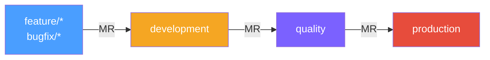
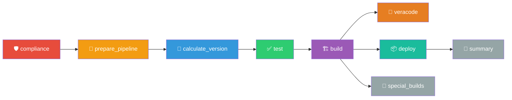

# Pipeline Android – PJ App (GitLab CI)

Pipeline GitLab CI para proyectos Android PJ de tipo **application**. Gestiona compilación Gradle multi-ambiente (DEV/QA), versionado beta + semántico, publicación a Generic Package Registry, análisis de seguridad con Veracode, y builds instrumentados con Guardsquare.

Archivo de entrada: `.mobile-pipeline-app.yml`

---

## Flujo de ramas



- MR fuera de este flujo se bloquean automáticamente (`exit 1`) con comentario en el MR.
- MR hacia branches no protegidos generan un comentario de advertencia pero no se bloquean.
- Tags no disparan el pipeline.
- Push directo en `development` ejecuta Semantic Release (crea tag).

Las reglas de ejecución por job viven en `files/shared/rules_components.yml` y se referencian con `!reference`.

---

## Runners

| Runner tag | Imagen | Uso |
|---|---|---|
| `devsecops-common` | `$RUNNER_DEFAULT_IMAGE_SECURE` / `$RUNNER_NODE_SECURE` | Compliance, rebase, versioning, summary, publish |
| `ec2-android` | `runner-android:1.0.0-secure` | Test, build, veracode |

---

## Noveracode

Si el título del MR contiene `noveracode` (case insensitive), los jobs de Veracode (6.1, 6.2) se omiten para cualquier ambiente (development, quality, production).

---

## Nomenclatura de ramas

```
^(development|quality|production|((feature|bugfix|unofficial)/(NOJIRA|[A-Za-z0-9._-]+)/[a-z0-9._-]+))$
```

Formato: `tipo/TICKET/descripcion`

---

## Nomenclatura de commits (Conventional Commits)

```
^(feat|fix|breaking): \[(NOJIRA|[A-Za-z0-9._-]+)\] .+$
```

### Efecto en el versionado semántico

| Tipo de commit | Release | Ejemplo de bump |
|---|---|---|
| `fix`, `hotfix`, `bugfix`, `patch` | patch | `1.0.0` → `1.0.1` |
| `feat`, `feature`, `minor` | minor | `1.0.0` → `1.1.0` |
| `feat!`, `break`, `breaking` | major | `1.0.0` → `2.0.0` |

---

## Stages



---

## Includes

El pipeline usa `files/PJ/yamls/.mobile-pipeline-include.yml` que incluye los mismos anchors PJ que el pipeline de módulos, más el componente `uploadv2` para builds instrumentados.

---

## Stage: compliance

### 1.1 Setting Compliance Variables
Genera `compliance.env`. Runner: `devsecops-common`.

### 1.2 Validate Compliance
Trigger downstream a `rule-validation`. Runner: `devsecops-common`.

---

## Stage: prepare_pipeline

### 2.1 No Protected Target Environment
Comentario advertencia. Runner: `devsecops-common`.

### 2.2 Blocked Merge Request
Falla MR no autorizado. Runner: `devsecops-common`.

### 2.3 Check Rebase Status
Verifica conflictos y rebase. Runner: `devsecops-common`.

### 2.4 Prepare Environment
Genera `build.env` + archivos per-env (`build.development.env`, `build.quality.env`, `build.production.env`). Runner: `devsecops-common`.

### 2.5 Retrieve Artifacts
Descarga dependencias. Runner: default (ec2-android).

### 2.6 Retrieve Secrets
Lee secretos de AWS. En MR feature→dev, también recupera secretos de QA (`ADDITIONAL_RETRIEVE_ENV_SUFFIXES: "_QUALITY"`). Runner: `devsecops-common`.

---

## Stage: calculate_version

| Job | Runner | Cuándo | Descripción |
|---|---|---|---|
| 3.1 Calculate Beta Version | devsecops-common | MR feature→dev | Beta incremental (`XbN`) |
| 3.2 Simulate Semantic Release | devsecops-common | MR feature→dev | Dry-run. Exporta `SEMANTIC_VERSION` |
| 3.3 Get Version | devsecops-common | MR dev→qa, qa→prod, push qa/prod | Lee tag existente |
| 3.4 Semantic Release | devsecops-common | Push a development | Crea tag semántico real |
| 3.5 Version Promotion Summary | devsecops-common | Todos los MR | Comenta versión promovida en MR |

---

## Stage: test

### 4.1 Test
Linter (detekt). `allow_failure: true`. Runner: default (ec2-android).

---

## Stage: build

### 5.1 Build DEV
Compila APK development. Variables: `TARGET_BRANCH=development`, `BUILD_ENV_SUFFIX=_DEVELOPMENT`. Se salta con `BUILD_DEV=false`. Runner: ec2-android. Retry: max 2.

### 5.2 Build QA
Compila APK quality. Variables: `TARGET_BRANCH=quality`, `BUILD_ENV_SUFFIX=_QUALITY`. Runner: ec2-android. Retry: max 2.

---

## Stage: veracode

### 6.1 Generate Binaries for Veracode
Prepara metadata. Se deshabilita con `veracodeoff=true` o `noveracode` en título del MR.

### 6.2 Send to Veracode
Trigger downstream a `template-pipeline-veracode`.

---

## Stage: deploy

### 7.1 Publish to Package Registry DEV
Publica APK DEV bajo `BASE_VERSION` (no la beta). Ej: versión del paquete = `1.1.7-development`. Se salta con `BUILD_DEV=false`. Runner: default (ec2-android).

### 7.2 Publish to Package Registry QA
Publica APK QA bajo `BASE_VERSION`. Ej: versión del paquete = `1.1.7-quality`. Runner: default (ec2-android).

### Diferencia de versión con módulos

| | App | Modules |
|---|---|---|
| Versión del paquete | `BASE_VERSION` + suffix (ej: `1.1.7-development`) | `APP_VERSION` + suffix (ej: `1.6.1b6-development`) |
| Nombre del archivo | Contiene beta (ej: `app-1.1.7b7-72-development.apk`) | Contiene beta (ej: `dashboard-1.6.1b6-development.aar`) |

---

## Stage: summary

### 8.1 Comment Summary
Comenta en MR con:
- Link al pipeline
- Artefactos publicados (URLs directas, solo los del pipeline actual filtrados por `APP_VERSION`)
- Tag asociado

Usa template `templates/mr_artifacts.md`. Solo muestra lo que existe — sin secciones vacías. Runner: `devsecops-common`.

---

## Stage: special_builds

### 9.1 Guardsquare Instrumented Build
Build instrumentado con DexGuard. Solo si `PIPELINE_PROJECT_INSTRUMENTED_ENABLED=True` en `ci/config.yaml`. Runner: `devsecops-common`.

### 9.2 Upload Instrumented to Package Registry
Upload via componente `uploadv2`. Depende de 9.1.

---

## Variables y flags

### Control
| Variable | Efecto |
|---|---|
| `veracodeoff=true` | Salta Veracode |
| Título MR `noveracode` | Salta Veracode en cualquier ambiente |
| `BUILD_DEV=false` | Salta Build DEV y Publish DEV |

### Prefijos de versión
| Variable | Valor |
|---|---|
| `DEV_PREFIX` | `-development` |
| `QA_PREFIX` | `-quality` |

### Imágenes
| Variable | Imagen |
|---|---|
| default (`ec2-android`) | `runner-android:1.0.0-secure` |
| `$RUNNER_DEFAULT_IMAGE_SECURE` | Runner default seguro |
| `$RUNNER_NODE_SECURE` | `runner-node:24.11.0-secure` |
| `$RUNNER_ANDROID_SECURE` | `runner-android:1.0.0-secure` |

---

## Artefactos

| Tipo | Archivo | Retención |
|---|---|---|
| Compliance | `compliance.env` (dotenv) | — |
| Environment | `build.env`, `build.*.env` (dotenv) | — |
| Secrets | `secrets.env` (dotenv, no público) | — |
| Versionado | `.app_version_env`, `.semantic_version_env` (dotenv) | 1 día |
| Dependencies | untracked (no público) | — |
| Build DEV | `dwtoveracode/development/*`, `${RELEASE_DIRECTORY}/development/*` | — |
| Build QA | `dwtoveracode/quality/*`, `${RELEASE_DIRECTORY}/quality/*`, `build.env` | — |
| Instrumented | `downloaded_packages/*`, `build.env` (dotenv) | 1 día |

---

## Retry policy

```yaml
retry:
  max: 2
  when:
    - script_failure
    - runner_system_failure
    - stuck_or_timeout_failure
    - api_failure
    - scheduler_failure
```

Aplica a: 5.1 Build DEV, 5.2 Build QA, 9.1 Guardsquare. Los uploads vía componente usan `retry_max: 2`.

---

## Dependencias externas

### `ci/config.yaml` (proyecto consumidor)

Procesado por `yaml_to_env.py` en 2.4 Prepare Environment. Genera `build.env` + archivos per-env.

### Scripts Python (descarga via curl)

Descargados en runtime desde `PIPELINE_API_REPO_URL`.

---

## Matriz de ejecución

| Job | MR→dev | MR dev→qa | MR qa→prod | push dev |
|---|:---:|:---:|:---:|:---:|
| 1.1-1.2 Compliance | ✅ | ✅ | ✅ | ✅ |
| 2.3 Check Rebase Status | ✅ | ✅ | ✅ | — |
| 2.4 Prepare Environment | ✅ | ✅ | ✅ | ✅ |
| 2.5 Retrieve Artifacts | ✅ | ✅ | ✅ | ✅ |
| 2.6 Retrieve Secrets | ✅ | ✅ | ✅ | ✅ |
| 3.1 Calculate Beta Version | ✅ | — | — | — |
| 3.2 Simulate Semantic Release | ✅ | — | — | — |
| 3.3 Get Version | — | ✅ | ✅ | — |
| 3.4 Semantic Release | — | — | — | ✅ |
| 3.5 Version Promotion Summary | ✅ | ✅ | ✅ | — |
| 4.1 Test | ✅ | ✅ | ✅ | — |
| 5.1 Build DEV | ✅ | — | — | — |
| 5.2 Build QA | ✅ | ✅ | ✅ | — |
| 6.1-6.2 Veracode | ✅ | ✅ | ✅ | — |
| 7.1 Publish DEV | ✅ | — | — | — |
| 7.2 Publish QA | ✅ | ✅ | ✅ | — |
| 8.1 Comment Summary | ✅ | ✅ | ✅ | — |
| 9.1-9.2 Guardsquare | — | instrumented | instrumented | — |
