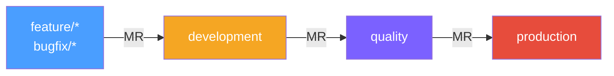
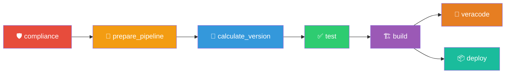
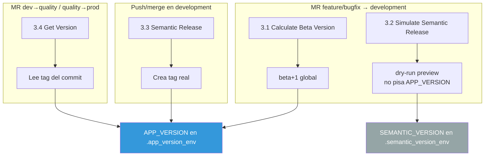
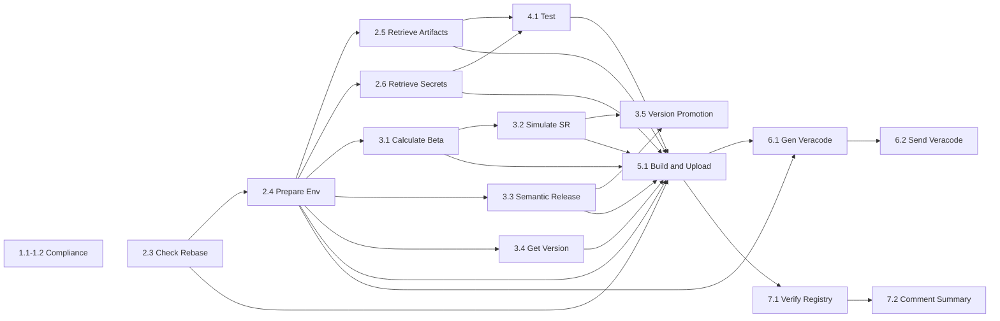

# Pipeline Android – PJ Modules / Library (GitLab CI)

Pipeline GitLab CI para proyectos Android PJ de tipo **library** (módulos). Gestiona compilación Gradle multi-módulo, versionado beta independiente, publicación a Maven Package Registry, análisis de seguridad con Veracode, y verificación de artefactos.

Archivo de entrada: `.mobile-pipeline.yml`

---

## Flujo de ramas



- MR fuera de este flujo se bloquean automáticamente (`exit 1`) con comentario en el MR.
- MR hacia branches no protegidos generan un comentario de advertencia pero no se bloquean.
- Tags no disparan el pipeline.
- Push directo en `development` dispara build + publish con versión semántica.

Las reglas de ejecución por job viven en `files/shared/rules_components.yml` y se referencian con `!reference`.

---

## Runners

| Runner tag | Imagen | Uso |
|---|---|---|
| `devsecops-common` | `$RUNNER_DEFAULT_IMAGE_SECURE` / `$RUNNER_NODE_SECURE` | Compliance, rebase, versioning, verify, summary |
| `ec2-android` | `runner-android:1.0.0-secure` | Test, build, veracode |

---

## Noveracode

Si el título del MR contiene `noveracode` (case insensitive), los jobs de Veracode (6.1, 6.2) se omiten para cualquier ambiente (development, quality, production).

---

## Nomenclatura de ramas

```
^(development|quality|production|((feature|bugfix|unofficial)/(NOJIRA|[A-Za-z0-9._-]+)/[a-z0-9._-]+))$
```

Formato: `tipo/TICKET/descripcion`

| Parte | Valores permitidos | Obligatorio |
|---|---|---|
| tipo | `feature`, `bugfix`, `unofficial` | sí |
| ticket | `NOJIRA` o ID alfanumérico | sí |
| descripción | minúsculas, números, `.`, `_`, `-` | sí |

---

## Nomenclatura de commits (Conventional Commits)

```
^(feat|fix|breaking): \[(NOJIRA|[A-Za-z0-9._-]+)\] .+$
```

### Efecto en el versionado semántico

| Tipo de commit | Release | Ejemplo de bump |
|---|---|---|
| `fix`, `hotfix`, `bugfix`, `patch` | patch | `1.0.0` → `1.0.1` |
| `feat`, `feature`, `minor` | minor | `1.0.0` → `1.1.0` |
| `feat!`, `break`, `breaking` | major | `1.0.0` → `2.0.0` |

---

## Stages



Los jobs usan `needs:` para formar un DAG y maximizar paralelismo.

---

## Includes

El pipeline se compone de archivos modulares incluidos desde `files/PJ/yamls/.mobile-pipeline-modules-include.yml`:

### Archivos locales

| Archivo | Propósito |
|---|---|
| `files/PJ/yamls/*-variables.yml` | Variables del pipeline |
| `files/PJ/yamls/*-workflow.yml` | Workflow rules |
| `files/shared/reusable_commands.yml` | Helpers: git auth, downloads, comentarios MR |
| `files/shared/rules_components.yml` | Anchors de reglas por tipo de MR/branch |
| `files/shared/check_rebase.yml` | Validación de rebase y conflictos |
| `files/shared/calculate_version.yml` | Cálculo de beta y versionado |

### Anchors PJ (`files/PJ/anchors/`)

| Archivo | Propósito |
|---|---|
| `build_and_publish_sequential.yml` | Build + publish secuencial para libraries multi-módulo |
| `prepare_environment.yml` | Prepare env, retrieve artifacts/secrets, comment summary, publish |
| `test_and_build.yml` | Test, build, veracode metadata |
| `set_environment_variables.yml` | Variables dinámicas por entorno (ENVIRONMENT_SUFFIX) |
| `prebuild_android_application.yml` | Pre-build: tag version en git (beta-aware) |
| `init_ssh_agent_guardsquare.yml` | SSH agent para DexGuard |
| `download_cacerts.yml` | Certificados CA para conexiones internas |
| `setup_android_linux_env.yml` | Java keystore hotfix |
| `verify_package_registry.yml` | Verificación de existencia en Package Registry |
| `copy_gradle_module_metadata.yml` | Copia `.module` metadata de Gradle |

---

## Stage: compliance

### 1.1 Setting Compliance Variables
Genera `compliance.env` (dotenv). Runner: `devsecops-common`.

### 1.2 Validate Compliance
Trigger downstream a `arq-devops-team/pipelines-gitlab/rule-validation` con `strategy: depend`. Runner: `devsecops-common`.

---

## Stage: prepare_pipeline

### 2.1 No Protected Target Environment
Comentario de advertencia si MR a branch no protegido. Runner: `devsecops-common`.

### 2.2 Blocked Merge Request
Falla con `exit 1` si combinación source/target no autorizada. Runner: `devsecops-common`.

### 2.3 Check Rebase Status
Verifica conflictos de merge y commits desfasados. Comenta en MR si hay problemas. Runner: `devsecops-common`.

### 2.4 Prepare Environment
Descarga scripts Python, ejecuta `yaml_to_env.py` para generar `build.env` desde `ci/config.yaml`. Runner: `devsecops-common`.

### 2.5 Retrieve Artifacts
Descarga dependencias Maven/Generic desde Package Registry. Runner: `devsecops-common`.

### 2.6 Retrieve Secrets
Lee secretos desde AWS Secrets Manager via STS assume-role. Runner: `devsecops-common`.

---

## Stage: calculate_version



| Job | Runner | Cuándo | Descripción |
|---|---|---|---|
| 3.1 Calculate Beta Version | devsecops-common | MR feature→dev | Calcula beta incremental (`XbN`), crea y pushea tag |
| 3.2 Simulate Semantic Release | devsecops-common | MR feature→dev | Dry-run informativo. Exporta `SEMANTIC_VERSION` (no pisa `APP_VERSION`) |
| 3.3 Semantic Release | devsecops-common | Push a development | Ejecuta semantic-release real, crea tag semántico |
| 3.4 Get Version | devsecops-common | MR dev→qa, qa→prod, push qa/prod | Obtiene versión del tag existente |
| 3.5 Version Promotion Summary | devsecops-common | Todos los MR | Comenta en MR la versión semántica promovida |

### Versionado beta

1. Obtiene el tag base más reciente (ej: `v1.6.1`)
2. Lista todas las betas existentes para esa base (`v1.6.1b1`, `v1.6.1b2`, ...)
3. Incrementa: `v1.6.1b5` → `v1.6.1b6`
4. Crea y pushea el tag al remote
5. Exporta `APP_VERSION=1.6.1b6` y `BASE_VERSION=1.6.1`

---

## Stage: test

### 4.1 Test
Ejecuta linter (detekt) via Gradle. `allow_failure: true`. Runner: `devsecops-common`. Retry: no.

---

## Stage: build

### 5.1 Build and Upload
Runner: `ec2-android`. Retry: max 2.

Compila módulos secuencialmente y publica al Maven Package Registry:

1. Pre-build: si beta, crea tag local con `APP_VERSION` para Gradle
2. Para cada módulo: build → generate POM → verify existence → upload
3. **Si el artefacto ya existe → falla** (no reemplaza, sin excepciones)
4. Muestra resumen con URLs publicadas

Versión del artefacto publicado:

| Contexto | APP_VERSION | Versión publicada |
|---|---|---|
| Pre-merge feature→dev | `1.6.1b6` | `1.6.1b6-development` |
| Post-merge development | `1.6.2` | `1.6.2-development` |
| Pre-merge dev→qa | `1.6.2` | `1.6.2-quality` |
| Pre-merge qa→prod | `1.6.2` | `1.6.2-production` |

---

## Stage: veracode

### 6.1 Generate Binaries for Veracode
Prepara metadata. Salta para libraries. Se deshabilita con `veracodeoff=true` o `noveracode` en título del MR.

### 6.2 Send to Veracode
Trigger downstream a `template-pipeline-veracode`. `allow_failure` en el trigger con `strategy: depend`.

---

## Stage: deploy

### 7.1 Verify Package Registry
Verifica existencia del artefacto publicado. `allow_failure: true`. Runner: `devsecops-common`. Usa script `verify_package_registry.py`.

### 7.2 Comment Summary
Comenta en MR con:
- Link al pipeline
- Artefactos publicados agrupados por versión (URLs directas)
- Tag asociado

Usa template compartida `templates/mr_artifacts.md`. Solo muestra lo que realmente existe — sin secciones vacías. Filtra por `APP_VERSION` para mostrar solo artefactos del pipeline actual.

Runner: `devsecops-common`. Solo corre en MR (no en push directo).

---

## Variables y flags

### Control
| Variable | Efecto |
|---|---|
| `veracodeoff=true` | Salta Veracode (6.1 y 6.2) |
| Título MR `noveracode` | Salta Veracode en cualquier ambiente |

### Prefijos de versión
| Variable | Valor |
|---|---|
| `DEV_PREFIX` | `-development` |
| `QA_PREFIX` | `-quality` |

### Imágenes
| Variable | Imagen |
|---|---|
| default (`ec2-android`) | `runner-android:1.0.0-secure` |
| `$RUNNER_DEFAULT_IMAGE_SECURE` | Runner default seguro |
| `$RUNNER_NODE_SECURE` | `runner-node:24.11.0-secure` |
| `$RUNNER_ANDROID_SECURE` | `runner-android:1.0.0-secure` |

---

## Artefactos

| Tipo | Archivo | Retención |
|---|---|---|
| Compliance | `compliance.env` (dotenv) | — |
| Environment | `build.env` (dotenv) | — |
| Secrets | `secrets.env` (dotenv, no público) | — |
| Versionado | `.app_version_env` (dotenv) | 1 día |
| Dependencies | untracked (no público) | — |
| Build | `dwtoveracode/*`, `${RELEASE_DIRECTORY}/*`, `build.env` (dotenv) | — |

---

## Retry policy

```yaml
retry:
  max: 2
  when:
    - script_failure
    - runner_system_failure
    - stuck_or_timeout_failure
    - api_failure
    - scheduler_failure
```

Aplica a: 5.1 Build and Upload.

---

## Dependencias externas

### `ci/config.yaml` (proyecto consumidor)

El job 2.4 Prepare Environment espera que el repositorio contenga `ci/config.yaml`. Este archivo es procesado por `yaml_to_env.py` y genera `build.env`. Si no existe, el job falla.

### Scripts Python (descarga via curl)

Los scripts se descargan en runtime desde el repositorio del pipeline via `PIPELINE_API_REPO_URL`.

---

## Matriz de ejecución

| Job | MR→dev | MR dev→qa | MR qa→prod | push dev |
|---|:---:|:---:|:---:|:---:|
| 1.1-1.2 Compliance | ✅ | ✅ | ✅ | ✅ |
| 2.3 Check Rebase Status | ✅ | ✅ | ✅ | — |
| 2.4 Prepare Environment | ✅ | ✅ | ✅ | ✅ |
| 2.5 Retrieve Artifacts | ✅ | ✅ | ✅ | ✅ |
| 2.6 Retrieve Secrets | ✅ | ✅ | ✅ | ✅ |
| 3.1 Calculate Beta Version | ✅ | — | — | — |
| 3.2 Simulate Semantic Release | ✅ | — | — | — |
| 3.3 Semantic Release | — | — | — | ✅ |
| 3.4 Get Version | — | ✅ | ✅ | — |
| 3.5 Version Promotion Summary | ✅ | ✅ | ✅ | — |
| 4.1 Test | ✅ | ✅ | ✅ | — |
| 5.1 Build and Upload | ✅ | ✅ | ✅ | ✅ |
| 6.1-6.2 Veracode | ✅ | ✅ | ✅ | — |
| 7.1 Verify Package Registry | ✅ | ✅ | ✅ | ✅ |
| 7.2 Comment Summary | ✅ | ✅ | ✅ | — |

---

## DAG (simplificado)


