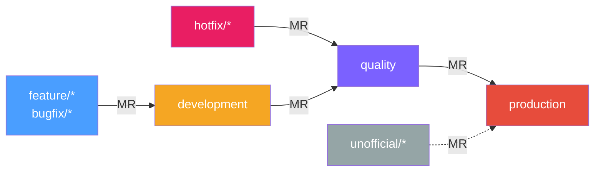
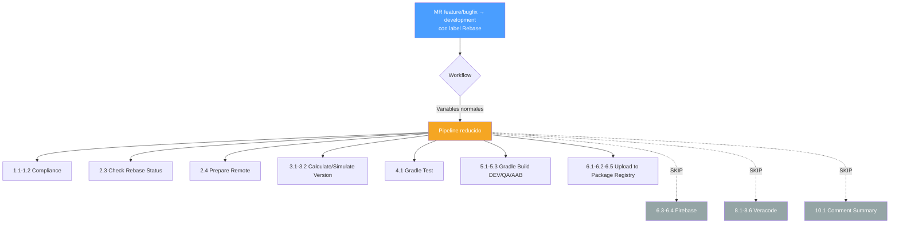
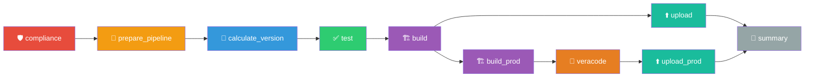
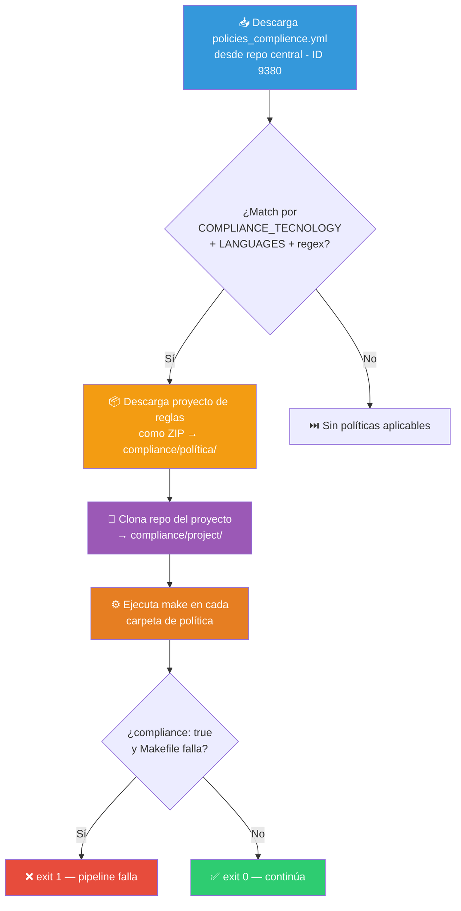
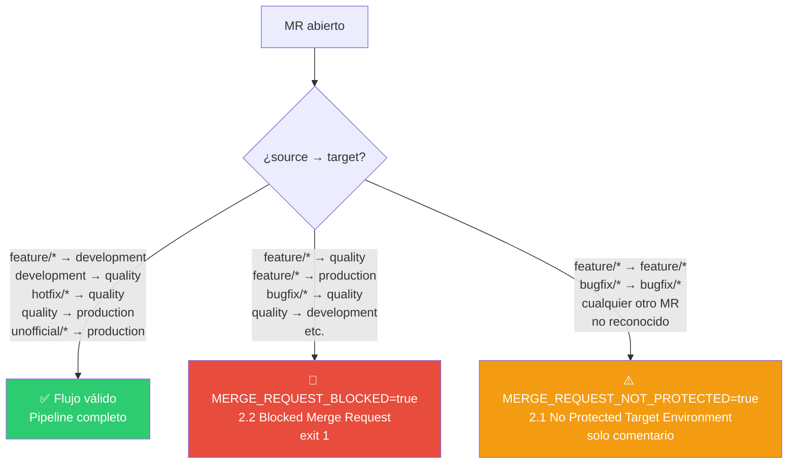
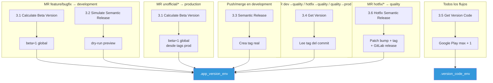
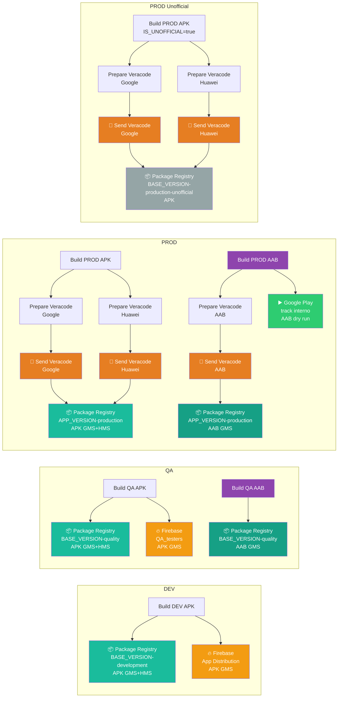
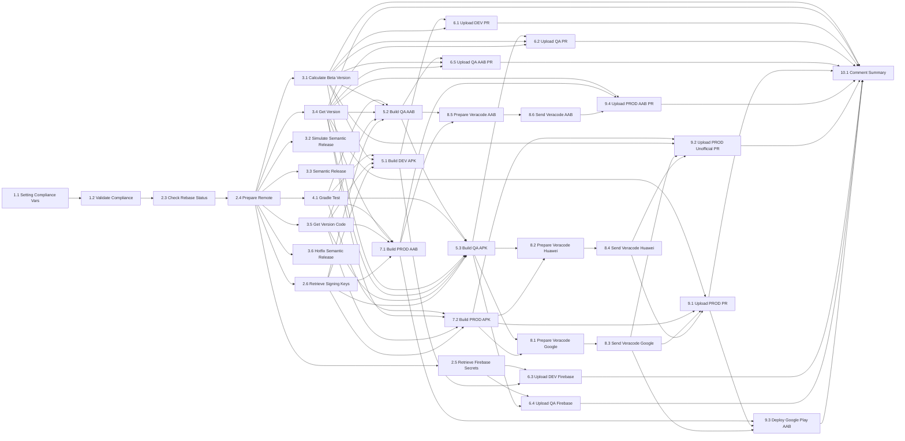

# Pipeline Android – SuperApp PF (GitLab CI) v3.0

Pipeline GitLab CI para la SuperApp Android PF. Gestiona compilación Gradle multi-provider (GMS/HMS), versionado semántico, análisis estático con Detekt, publicación a Package Registry / Firebase / Google Play, y análisis de seguridad con Veracode.

Archivo de entrada: `.mobile-superapp-android.yml`

---

## Flujo de ramas



- MR fuera de este flujo se bloquean automáticamente (`exit 1`) con comentario en el MR.
- MR hacia branches no protegidos generan un comentario de advertencia pero no se bloquean.
- Tags no disparan el pipeline.
- Push/web/schedule en `development` también disparan el pipeline (sin contexto MR).
- `hotfix/*` → `quality` permite correcciones urgentes con versionado propio (patch bump + tag + GitLab release).
- `unofficial/*` → `production` es un flujo descolgado para generar versiones y artefactos fuera del ciclo normal de release. El MR se abre únicamente para disparar el pipeline y generar los APKs; está prohibido aprobarlo y mergearlo a `production`, ya que no representa una versión candidata de actualización para la rama protegida.

Las reglas de ejecución por job viven en `files/shared/rules_components.yml` y se referencian con `!reference`.

---

## Runners

| Runner tag | Imagen | Concurrencia | Uso |
|---|---|---|---|
| `devsecops-common` | `runner-android:image-v3` | — | Default para todos los jobs |
| `ec2-android` | `$RUNNER_ANDROID_SECURE` | 4 | Builds pesados Gradle/Fastlane |

---

## Flujo de causalidad: label `Rebase`

Cuando un MR de `feature/*` o `bugfix/*` hacia `development` tiene la variable `MAKE_REBASE: "true"` en GitLab `Settings > CI/CD > Variables`, el pipeline ejecuta un flujo reducido: compila y testea, pero omite análisis de seguridad secundario y distribución externa.



Jobs que se saltan con `MAKE_REBASE == "true"`:
- 6.3 Upload DEV to Firebase
- 6.4 Upload QA to Firebase
- 8.1-8.6 Prepare/Send files for Veracode (Google/Huawei/AAB)
- 10.1 Comment Summary

Una vez validado, se remueve la label `Rebase` y el siguiente pipeline ejecuta el flujo completo.

---

## Noveracode

Si el título del MR contiene `noveracode` (case insensitive), los jobs de Veracode se omiten para ese flujo. Controlado mediante anchors de reglas:

| Anchor | Flujo afectado |
|---|---|
| `.rules_noveracode_development` | feature/bugfix → development |
| `.rules_noveracode_quality` | development → quality |
| `.rules_noveracode_hotfix` | hotfix/* → quality |
| `.rules_noveracode_production` | quality → production |

---

## Nomenclatura de ramas

El proyecto tiene configurada la siguiente regex en GitLab (Push Rules > Branch name):

```
^(development|quality|production|((feature|bugfix|hotfix|unofficial)/(NOJIRA|[A-Za-z0-9._-]+)/[a-z0-9._-]+))$
```

Formato: `tipo/TICKET/descripcion`

| Parte | Valores permitidos | Obligatorio |
|---|---|---|
| tipo | `feature`, `bugfix`, `hotfix`, `unofficial` | sí |
| ticket | `NOJIRA` o ID alfanumérico (ej: `JIRA-123`, `SA-456`) | sí |
| descripción | minúsculas, números, `.`, `_`, `-` | sí |

Ejemplos válidos:
```
feature/JIRA-123/login-biometrico
bugfix/SA-456/fix-crash-home
hotfix/SA-789/fix-critical-payment
unofficial/NOJIRA/hotfix-cliente-x
```

---

## Nomenclatura de commits (Conventional Commits)

El proyecto tiene configurada la siguiente regex en GitLab (Push Rules > Commit messages):

```
^(feat|fix|breaking): \[(NOJIRA|[A-Za-z0-9._-]+)\] .+$
```

Formato: `tipo: [TICKET] descripción`

| Parte | Valores permitidos | Obligatorio |
|---|---|---|
| tipo | `feat`, `fix`, `breaking` | sí |
| ticket | `NOJIRA` o ID alfanumérico entre `[]` | sí |
| descripción | texto libre | sí |

Ejemplos válidos:
```
feat: [JIRA-123] agregar autenticación biométrica
fix: [SA-456] corregir crash al abrir detalle de tarjeta
breaking: [JIRA-789] rediseño completo del módulo de pagos
feat: [NOJIRA] ajuste menor en UI de dashboard
```

Los únicos tipos de commit permitidos por la push rule son `feat`, `fix` y `breaking`. Cualquier otro tipo (ej: `chore`, `refactor`, `docs`) será rechazado por GitLab al hacer push, a menos que entre por el fallback temporal.

### Efecto en el versionado semántico

El semantic-release analiza los commits mergeados a `development` y determina el bump de versión:

| Tipo de commit | Release | Ejemplo de bump |
|---|---|---|
| `fix`, `hotfix`, `bugfix`, `patch` | patch | `1.0.0` → `1.0.1` |
| `feat`, `feature`, `minor` | minor | `1.0.0` → `1.1.0` |
| `feat!`, `break`, `breaking` | major | `1.0.0` → `2.0.0` |

Tipos reconocidos que no generan release: `chore`, `docs`, `doc`, `style`, `refactor`, `perf`, `test`.

---

## Stages



Los jobs usan `needs:` para formar un DAG y maximizar paralelismo.

---

## Includes

El pipeline se compone de archivos modulares incluidos desde `files/PF/yamls/.mobile-superapp-android-include.yml`:

### Archivos locales

| Archivo | Propósito |
|---|---|
| `files/PF/yamls/*-variables.yml` | Variables del pipeline |
| `files/PF/yamls/*-workflow.yml` | Workflow rules |
| `files/shared/rules_components.yml` | Anchors de reglas por tipo de MR/branch |
| `files/shared/calculate_version.yml` | Cálculo de beta y versionado |
| `files/shared/check_rebase.yml` | Validación de rebase y conflictos |
| `files/shared/reusable_commands.yml` | Helpers: git auth, downloads, comentarios MR |

### Anchors PF (`files/PF/anchors/`)

| Archivo | Propósito |
|---|---|
| `download_pf_scripts.yml` | Descarga individual de scripts PF via curl |
| `fastlane_build_aab.yml` | Build AAB via Fastlane (GMS only) |
| `firebase_upload.yml` | Upload a Firebase App Distribution |
| `deploy_google_play.yml` | Deploy AAB a Google Play Store |
| `prepare_keystore.yml` | Keystore debug/release + DexGuard license |
| `retrieve_secrets.yml` | Firebase token via AWS STS assume-role |
| `retrieve_signing_keys.yml` | KEY_ALIAS, KEY_PASSWORD, KEY_STORE_PASSWORD via AWS |
| `run_parametrized_builds.yml` | Loop de build scripts + mover APKs |
| `veracode_prepare.yml` | Metadata y archivos para Veracode |
| `hotfix_semantic_version.yml` | Patch bump, tag y GitLab release para hotfix |
| `comment_summary.yml` | Comentario resumen en MR |

### Componente externo

`componente-package-registry/uploadv2@main` para uploads a Package Registry.

---

## Stage: compliance

Gate obligatorio que valida políticas organizacionales antes de continuar.

### 1.1 Setting Compliance Variables
Genera `compliance.env` (dotenv) con:
- `COMPLIANCE_TECNOLOGY=mobile`
- `COMPLIANCE_LANGUAGES=$CI_PROJECT_REPOSITORY_LANGUAGES`
- `COMPLIANCE_PROJECT=$CI_PROJECT_PATH`

### 1.2 Validate Compliance
Dispara un pipeline downstream en `arq-devops-team/pipelines-gitlab/rule-validation` (rama `main`) con `strategy: depend`. El pipeline padre espera el resultado.

Variables enviadas al downstream:
- Las 3 de compliance (vía `forward: yaml_variables` + `pipeline_variables`).
- `REPO_ID=$CI_PROJECT_ID`

### ¿Qué hace rule-validation internamente?

Proyecto centralizado mantenido por DevSecOps (`arq-devops-team/pipelines-gitlab/rule-validation`). Ejecuta un único job `lint`:



Detalles:
- La rama clonada depende del tipo: `library` → `main`, `application` (default) → `development`.
- Timeout por Makefile: 90 segundos.
- Políticas con `compliance: false` que fallan se registran pero no bloquean.
- Resultados en `output/` (expire 7 días).

---

## Stage: prepare_pipeline

### Protección de flujo de MR

El `workflow` del pipeline evalúa cada MR y clasifica su combinación source → target en una de tres categorías:



| Escenario | Variable seteada | Job que corre | Resultado |
|---|---|---|---|
| MR válido (flujo autorizado) | Variables de entorno (`ENVIRONMENT`, etc.) | Pipeline completo (2.3 → 2.4 → ... → 10.1) | Build, test, upload |
| MR con target protegido pero source no autorizado | `MERGE_REQUEST_BLOCKED=true` | 2.2 Blocked Merge Request | Comentario en MR + `exit 1` (pipeline falla) |
| MR hacia branch no protegido / no reconocido | `MERGE_REQUEST_NOT_PROTECTED=true` | 2.1 No Protected Target Environment | Comentario de advertencia (pipeline termina sin más jobs) |

Ejemplos concretos de cada caso:

| MR | Categoría |
|---|---|
| `feature/X` → `development` | ✅ Válido |
| `development` → `quality` | ✅ Válido |
| `hotfix/X` → `quality` | ✅ Válido |
| `quality` → `production` | ✅ Válido |
| `unofficial/X` → `production` | ✅ Válido (descolgado) |
| `feature/X` → `quality` | 🚫 Bloqueado |
| `feature/X` → `production` | 🚫 Bloqueado |
| `quality` → `development` | 🚫 Bloqueado |
| `feature/A` → `feature/B` | ⚠️ No protegido |
| `bugfix/A` → `bugfix/B` | ⚠️ No protegido |

### 2.1 No Protected Target Environment
Se activa cuando `MERGE_REQUEST_NOT_PROTECTED=true`. Publica un comentario en el MR advirtiendo que el target no es un entorno protegido y sugiere seguir el flujo autorizado. No bloquea el pipeline, pero ningún otro job se ejecuta porque las reglas de los demás jobs no matchean esta combinación.

### 2.2 Blocked Merge Request
Se activa cuando `MERGE_REQUEST_BLOCKED=true`. Publica un comentario descriptivo indicando la combinación source/target no autorizada y aborta con `exit 1`. El pipeline falla intencionalmente para señalizar que el MR no es válido.

### 2.3 Check Rebase Status
Valida el estado del MR: cierra MR no válidos, verifica conflictos y si la rama source está desfasada respecto al target (behind commits). No se ejecuta en flujo unofficial.

### 2.4 Prepare Remote
Descarga `read_config.py` via curl, lee `ci/config.yaml` del proyecto y genera `build.env` (dotenv) con variables de configuración (packages, flavors, etc.). Imagen: `$RUNNER_ANDROID_SECURE`.

### 2.5 Retrieve Firebase Secrets
Recupera `FIREBASE_DISTRIBUTION_TOKEN` desde AWS Secrets Manager usando STS assume-role (extrae account ID del ARN del secret). Publica `secrets.env` (dotenv, `access: none`). Solo se ejecuta en flujos DEV y QA. Imagen: `$RUNNER_AWS_IMAGE`.

### 2.6 Retrieve Signing Keys
Recupera `KEY_ALIAS`, `KEY_PASSWORD` y `KEY_STORE_PASSWORD` desde AWS Secrets Manager. Publica dotenv con las credenciales de firma. Imagen: `$RUNNER_AWS_IMAGE`.

---

## Stage: calculate_version



| Job | Descripción | Cuándo |
|---|---|---|
| 3.1 Calculate Beta Version | Calcula beta+1 global desde tags. Publica `APP_VERSION`, `BASE_VERSION`, `VERSION_WITH_V`, `VERSION_NAME`, `PIPELINE_ID` en `.app_version_env` | MR feature/bugfix → development, unofficial → production |
| 3.2 Simulate Semantic Release | `semantic-release --dry-run` para previsualizar versión. Publica `APP_VERSION`, `VERSION_NAME`, `BASE_VERSION`, `VERSION_WITH_V` | MR feature/bugfix → development |
| 3.3 Semantic Release | Ejecuta semantic-release real (crea tag). Publica `.app_version_env` | Push/merge en development |
| 3.4 Get Version | Obtiene versión desde tag del commit actual. Publica `APP_VERSION`, `BASE_VERSION` | MR dev → quality, hotfix → quality, quality → production |
| 3.5 Get Version Code | Consulta Google Play vía Fastlane (`check_play_versions`), obtiene max version code + 1. Publica `.version_code_env` | Todos los flujos |
| 3.6 Hotfix Semantic Release | Patch bump, crea tag y GitLab release para hotfix. Publica `.app_version_env` | MR hotfix/* → quality |

Los jobs de build y upload consumen `.app_version_env`, `.version_code_env` y `build.env`.

---

## Stage: test

### 4.1 Gradle Test
Ejecuta Detekt (análisis estático). Runner: `ec2-android`. Publica `test.txt` como evidencia. Falla si no reporta `BUILD SUCCESSFUL`. Retry: max 2. No depende del cálculo de versión, por lo que corre en paralelo con los jobs de `calculate_version`.

---

## Stage: build

Todos los builds APK usan scripts parametrizados por provider (`parametrized_build_google.sh`, `parametrized_build_huawei.sh`). Los builds AAB usan Fastlane (solo GMS). Runner: `ec2-android`. Retry: max 2.

### Serialización para prevención de OOM

En el flujo `feature→dev`, el job 5.3 (Gradle Build QA APK) espera a que 5.2 (Fastlane Build QA AAB) termine antes de ejecutarse. Esto evita que dos builds pesados corran simultáneamente en el mismo runner y provoquen OOM.

En el flujo `quality→prod`, los jobs 7.1 (Fastlane Build PROD AAB) y 7.2 (Gradle Build PROD APK) corren en paralelo, ya que solo hay 1 pipeline a la vez en ese flujo.

Todos los jobs de compilación imprimen el estado de memoria (`free -h`) antes de ejecutar. Si la memoria disponible es menor a 4 GB, se imprime un warning recomendando cancelar el job y reintentar cuando haya recursos disponibles.

### 5.1 Gradle Build DEV (APK)
- Runner: `ec2-android`
- Keystore: `itau_debug.keystore` (debug)
- Gradle tasks: `assembleGmsDevelopment`, `assembleHmsDevelopment`
- Mueve APKs `*development*` a `${RELEASE_PATH}`
- Reglas: MR feature/bugfix → development

### 5.2 Fastlane Build QA AAB
- Runner: `ec2-android`
- Compila AAB via Fastlane lane `build_qa_aab` (solo GMS)
- Gradle task: `bundleGmsQuality`
- Keystore: `release.keystore` (signing keys desde AWS Secrets Manager)
- DexGuard: no aplica en quality (solo 1 AAB generado)
- Renombra y mueve AAB a `${RELEASE_PATH}` con nombre estandarizado
- Output (1 archivo): `cl-android-superapp-gms-quality-{version}-{versionCode}-pipeline-{pipelineId}.aab`
- Reglas: MR feature/bugfix → development, development → quality, hotfix → quality
- **Corre PRIMERO** (antes de 5.3 para evitar OOM)

### 5.3 Gradle Build QA (APK)
- Runner: `ec2-android`
- Keystore: `release.keystore` (signing keys desde AWS Secrets Manager)
- Gradle tasks: `assembleGmsQuality`, `assembleHmsQuality`
- Mueve APKs `*quality*` a `${RELEASE_PATH}`
- Reglas: MR feature/bugfix → development, development → quality, hotfix → quality
- **Espera a 5.2** para evitar OOM en feature→dev

---

## Stage: build_prod

### 7.1 Fastlane Build PROD AAB
- Runner: `ec2-android`
- Compila AAB via Fastlane lane `build_prod_aab` (solo GMS)
- Gradle task: `bundleGmsProduction`
- Keystore: `release.keystore` (signing keys desde AWS Secrets Manager)
- DexGuard: aplica en production (genera 2 AABs: normal + protected)
- Renombra y mueve ambos AABs a `${RELEASE_PATH}` con nombre estandarizado
- Output (2 archivos):
  - `cl-android-superapp-gms-production-{version}-{versionCode}-pipeline-{pipelineId}.aab` (normal)
  - `cl-android-superapp-gms-production-{version}-{versionCode}-pipeline-{pipelineId}-protected.aab` (ofuscado)
- El AAB **protected** es el que se sube a Google Play
- El AAB **normal** es el que se envía a Veracode (análisis estático requiere bytecode sin ofuscar)
- Reglas: MR quality → production, unofficial → production
- **Corre PRIMERO**, en paralelo con 7.2

### 7.2 Gradle Build PROD (APK)
- Runner: `ec2-android`
- Keystore: `release.keystore` (signing keys desde AWS Secrets Manager)
- Gradle tasks: `assembleGmsProduction`, `assembleHmsProduction`
- Mueve APKs `*production*` a `${RELEASE_PATH}` (4 archivos: gms normal, gms protected, hms normal, hms protected)
- Cuando `IS_UNOFFICIAL=true`, renombra APKs agregando `${UNOFFICIAL_PREFIX}` antes de `.apk`
- Reglas: MR quality → production, unofficial → production
- **Corre en paralelo** con 7.1

---

## Stages: veracode, upload, upload_prod — Publicación



### Package Registry (DEV/QA)

| Job | Artifact | Version | Rules |
|---|---|---|---|
| 6.1 Upload DEV | `*development*.apk` (GMS+HMS) | `${BASE_VERSION}-development` | feature/bugfix → development |
| 6.2 Upload QA | `*quality*.apk` (GMS+HMS) | `${BASE_VERSION}-quality` | feature/bugfix → development, dev → quality, hotfix → quality |
| 6.5 Upload QA AAB | `*quality*.aab` (GMS) | `${BASE_VERSION}-quality` | feature/bugfix → development, dev → quality, hotfix → quality |

Todos usan `componente-package-registry/uploadv2@main` con `auth_method: custom_token`.

### Firebase App Distribution

| Job | APK | Reglas |
|---|---|---|
| 6.3 Upload DEV to Firebase | `*development*.apk` (GMS) via Fastlane `upload_dev_to_firebase` | feature/bugfix → development |
| 6.4 Upload QA to Firebase | `*quality*.apk` (GMS) via Fastlane `upload_qa_to_firebase` (grupo `QA_testers`) | feature/bugfix → development, dev → quality, hotfix → quality |

Se saltan si `FIREBASE_UPLOAD_STEP` o `GOOGLE_BUILD` es `"false"`.

### Veracode

Antes de publicar a Package Registry PROD, los artefactos pasan por Veracode. Se incluyen APKs QA y PROD (excluye DEV y branches protegidos):

| Job | Descripción | allow_failure |
|---|---|---|
| 8.1 Prepare files for Veracode (Google) | Mueve APK GMS (QA + PROD) al directorio Veracode | — |
| 8.2 Prepare files for Veracode (Huawei) | Mueve APK HMS (QA + PROD) al directorio Veracode | — |
| 8.3 Send to Veracode (Google) | Trigger downstream a `template-pipeline-veracode` | `true` |
| 8.4 Send to Veracode (Huawei) | Trigger downstream a `template-pipeline-veracode` | `true` |
| 8.5 Prepare files for Veracode (AAB) | Mueve AAB GMS (QA + PROD) al directorio Veracode | — |
| 8.6 Send to Veracode (AAB) | Trigger downstream a `template-pipeline-veracode` | `true` |

Se saltan si `GOOGLE_VERACODE_STEP` o `HUAWEI_VERACODE_STEP` es `"false"`, o si el título del MR contiene `noveracode`.

### Package Registry (PROD)

| Job | Artifact | Version | Rules |
|---|---|---|---|
| 9.1 Upload PROD | `*production*.apk` (GMS+HMS) | `${APP_VERSION}-production` | quality → production |
| 9.4 Upload PROD AAB | `*production*.aab` (GMS) | `${APP_VERSION}-production` | quality → production |

Requiere: Veracode Google y Huawei completados (optional).

### 9.3 Deploy PROD to Google Play
- AAB: `*gms*production*protected*.aab` → track interno vía Fastlane
- Usa lane `deploy_prod_to_play_store` con parámetro `aab_path`
- Sube el AAB **protected** (ofuscado por DexGuard), igual que antes se subía el APK protected
- `GOOGLE_PLAY_DRY_RUN: "true"` por defecto (solo valida, no publica)
- Requiere: `GOOGLE_PLAY_CREDENTIALS_B64`, job 7.1 Fastlane Build PROD AAB completado, 9.1 Upload PROD completado
- Reglas: MR quality → production (NO se ejecuta en unofficial)

### Package Registry (PROD Unofficial)

| Job | Artifact | Version | Rules |
|---|---|---|---|
| 9.2 Upload PROD Unofficial | `*production*unofficial*.apk` | `${BASE_VERSION}-production-unofficial` | unofficial → production |

- Requiere: Veracode Google y Huawei completados
- No sube a Google Play ni Firebase
- No usa el Package Registry estándar de producción
- El MR es solo para disparar el pipeline. No debe aprobarse ni mergearse a `production`.

---

## Stage: summary

### 10.1 Comment Summary
Genera un comentario en el MR con:
- Pipeline ID y URL
- Tag de versión
- Lista de artefactos del Package Registry con URLs de descarga

`allow_failure` activado.

---

## Variables y flags

### Control de build
| Variable | Default | Efecto si `"false"` |
|---|---|---|
| `GOOGLE_BUILD` | — | Salta builds Google (GMS) |
| `HUAWEI_BUILD` | — | Salta builds Huawei (HMS) |
| `GOOGLE_VERACODE_STEP` | `"true"` | Omite Veracode Google |
| `HUAWEI_VERACODE_STEP` | `"true"` | Omite Veracode Huawei |
| `GOOGLE_PLAY_DEPLOY_STEP` | `"true"` | Omite deploy a Google Play (9.3) |
| `FIREBASE_UPLOAD_STEP` | `"true"` | Omite uploads a Firebase |
| `GOOGLE_PLAY_DRY_RUN` | `"true"` | Si `"true"`, valida AAB sin publicar en Google Play |
| `BUILD_DEV` | — | Controla si el build DEV se ejecuta |
| `IS_UNOFFICIAL` | `"false"` | Si `"true"`, activa flujo unofficial (renombrado APKs, upload separado, sin Google Play) |
| `MAKE_REBASE` | `"false"` | Si `"true"`, ejecuta pipeline reducido (sin Firebase, Veracode, Summary) |
| `veracodeoff` | `"false"` | Si `"true"`, desactiva Veracode globalmente |
| `RUN_FEATURE_PIPELINE` | — | Si `"true"`, permite pipelines por push directo en ramas feature/bugfix (sin MR) |

### Prefijos de versión
| Variable | Valor |
|---|---|
| `DEV_PREFIX` | `-development` |
| `QA_PREFIX` | `-quality` |
| `PROD_PREFIX` | `-production` |
| `UNOFFICIAL_PREFIX` | `-unofficial` |

### Imágenes
| Variable | Imagen | Uso |
|---|---|---|
| default (runner `devsecops-common`) | `runner-android:image-v3` | Jobs generales |
| `$RUNNER_ANDROID_SECURE` | Runner Android seguro (ec2-android) | Builds pesados, Fastlane |
| `$RUNNER_AWS_IMAGE` | Runner AWS seguro | 2.5 Retrieve Firebase Secrets, 2.6 Retrieve Signing Keys |

### Distribución de runners

| Runner | Jobs |
|---|---|
| `ec2-android` | 4.1 Gradle Test, 5.1 Build DEV, 5.2 Build QA AAB, 5.3 Build QA APK, 7.1 Build PROD AAB, 7.2 Build PROD APK |
| `devsecops-common` | Todos los demás (compliance, prepare, version, upload, veracode triggers, summary) |

---

## Fastlane lanes (proyecto consumidor)

| Lane | Descripción | Parámetros |
|---|---|---|
| `check_play_versions` | Consulta version code máximo en Google Play | — |
| `upload_dev_to_firebase` | Sube APK DEV a Firebase App Distribution | `apk_path` |
| `upload_qa_to_firebase` | Sube APK QA a Firebase App Distribution | `apk_path` |
| `build_qa_aab` | Compila AAB QA (bundleGmsQuality) | `flavor` |
| `build_prod_aab` | Compila AAB PROD (bundleGmsProduction) | `flavor` |
| `deploy_prod_to_play_store` | Despliega AAB a Google Play (track interno) | `aab_path`, `dry_run` |

---

## Artefactos

| Tipo | Archivo | Retención |
|---|---|---|
| Versionado | `.app_version_env`, `.version_code_env` (dotenv) | 1 día |
| Build APK | `${RELEASE_PATH}/*.apk` (normal + protected, GMS + HMS), `build.env` (dotenv) | 1 día |
| Build AAB QA | `${RELEASE_PATH}/*quality*.aab` (1 archivo: normal), `build.env` (dotenv) | 1 día |
| Build AAB PROD | `${RELEASE_PATH}/*production*.aab` (2 archivos: normal + protected), `build.env` (dotenv) | 1 día |
| Veracode APK | `${VERACODE_DIR_NAME}/*gms*.apk`, `*hms*.apk` (normal, sin protected) | 2 horas |
| Veracode AAB | `${VERACODE_DIR_NAME}/*gms*.aab` (normal, sin protected) | 2 horas |
| Compliance/Secrets | `compliance.env`, `secrets.env`, `signing_keys.env` (dotenv, no públicos) | — |

---

## Retry policy

Los jobs de build, test y veracode comparten una política de retry común:

```yaml
retry:
  max: 2
  when:
    - script_failure
    - runner_system_failure
    - stuck_or_timeout_failure
    - api_failure
    - scheduler_failure
```

Esto significa que ante fallos transitorios del runner, timeouts o errores de API de GitLab, el job se reintenta hasta 2 veces automáticamente. Los jobs de upload vía componente (`componente-package-registry/uploadv2`) usan `retry_max: 2` como input del componente.

Jobs con retry: 4.1 Gradle Test, 5.1 Gradle Build DEV, 5.2 Fastlane Build QA AAB, 5.3 Gradle Build QA, 7.1 Fastlane Build PROD AAB, 7.2 Gradle Build PROD, 8.1/8.2/8.5 Prepare files for Veracode, 6.1/6.2/6.5/9.1/9.2/9.4 uploads a Package Registry.

---

## Dependencias externas

### Descarga de scripts via curl

Los scripts del pipeline se descargan individualmente via curl desde la API de GitLab, sin clonar el repositorio completo. Cada anchor descarga solo el script que necesita:

| Anchor | Script descargado | Usado en |
|---|---|---|
| `.downloads_read_config` | `files/PF/scripts/read_config.py` | 2.4 Prepare Remote |
| `.downloads_parametrized_build_google` | `files/PF/scripts/parametrized_build_google.sh` | 5.1, 5.3, 7.2 Builds |
| `.downloads_parametrized_build_huawei` | `files/PF/scripts/parametrized_build_huawei.sh` | 5.1, 5.3, 7.2 Builds |
| `.downloads_fastlane_build_aab` | `files/PF/scripts/fastlane_build_aab.sh` | 5.2, 7.1 Builds AAB |
| `.downloads_veracode_move_files` | `files/PF/scripts/veracode_move_files.sh` | 8.1, 8.2 Veracode |
| `.downloads_veracode_move_files_aab` | `files/PF/scripts/veracode_move_files_aab.sh` | 8.5 Veracode AAB |

La URL base se construye con `PIPELINE_API_REPO_URL` y la rama con `PIPELINE_BRANCH`.

### `ci/config.yaml` (proyecto consumidor)

El job 2.4 Prepare Remote espera que el repositorio de la SuperApp contenga un archivo `ci/config.yaml` en su raíz. Este archivo es procesado por `read_config.py` y genera `build.env` con variables de configuración del proyecto como:

- Nombres de paquetes por entorno (`DEVELOPMENT_PACKAGE`, `QUALITY_PACKAGE`, `PRODUCTION_PACKAGE`)
- App IDs de Firebase (`FIREBASE_DEV_APP_ID`, `FIREBASE_QUALITY_APP_ID`)
- Tracks de Google Play (`INTERNAL_TRACK`, `PRODUCTION_TRACK`)
- Versiones de herramientas (`GRADLE_VERSION`, `TEMURIN_VERSION`)
- Cualquier otra variable específica del proyecto

Si `ci/config.yaml` no existe o `build.env` resulta vacío, el job falla con error explícito. Todos los jobs posteriores consumen `build.env` vía dotenv artifacts.

---

## Matriz de jobs por flujo de MR

Referencia rápida de qué jobs se ejecutan según el tipo de MR:

| Job | feature→dev | feature→dev (Rebase) | dev→quality | hotfix→quality | quality→prod | unofficial→prod |
|---|:---:|:---:|:---:|:---:|:---:|:---:|
| 1.1 Setting Compliance Variables | ✅ | ✅ | ✅ | ✅ | ✅ | ✅ |
| 1.2 Validate Compliance | ✅ | ✅ | ✅ | ✅ | ✅ | ✅ |
| 2.1 No Protected Target Environment | — | — | — | — | — | — |
| 2.2 Blocked Merge Request | — | — | — | — | — | — |
| 2.3 Check Rebase Status | ✅ | ✅ | ✅ | ✅ | ✅ | — |
| 2.4 Prepare Remote | ✅ | ✅ | ✅ | ✅ | ✅ | ✅ |
| 2.5 Retrieve Firebase Secrets | ✅ | ✅ | ✅ | ✅ | — | — |
| 2.6 Retrieve Signing Keys | ✅ | ✅ | ✅ | ✅ | ✅ | ✅ |
| 3.1 Calculate Beta Version | ✅ | ✅ | — | — | — | ✅ |
| 3.2 Simulate Semantic Release | ✅ | ✅ | — | — | — | — |
| 3.3 Semantic Release | — | — | — | — | — | — |
| 3.4 Get Version | — | — | ✅ | ✅ | ✅ | — |
| 3.5 Get Version Code | ✅ | ✅ | ✅ | ✅ | ✅ | ✅ |
| 3.6 Hotfix Semantic Release | — | — | — | ✅ | — | — |
| 4.1 Gradle Test | ✅ | ✅ | ✅ | ✅ | ✅ | ✅ |
| 5.1 Gradle Build DEV (APK) | ✅ | ✅ | — | — | — | — |
| 5.2 Fastlane Build QA AAB | ✅ | ✅ | ✅ | ✅ | — | — |
| 5.3 Gradle Build QA (APK) | ✅ | ✅ | ✅ | ✅ | — | — |
| 6.1 Upload DEV to Package Registry | ✅ | ✅ | — | — | — | — |
| 6.2 Upload QA to Package Registry | ✅ | ✅ | ✅ | ✅ | — | — |
| 6.3 Upload DEV to Firebase | ✅ | — | — | — | — | — |
| 6.4 Upload QA to Firebase | ✅ | — | ✅ | ✅ | — | — |
| 6.5 Upload QA AAB to Package Registry | ✅ | ✅ | ✅ | ✅ | — | — |
| 7.1 Fastlane Build PROD AAB | — | — | — | — | ✅ | ✅ |
| 7.2 Gradle Build PROD (APK) | — | — | — | — | ✅ | ✅ |
| 8.1 Prepare files for Veracode (Google) | ✅ | — | ✅ | ✅ | ✅ | ✅ |
| 8.2 Prepare files for Veracode (Huawei) | ✅ | — | ✅ | ✅ | ✅ | ✅ |
| 8.3 Send to Veracode (Google) | ✅ | — | ✅ | ✅ | ✅ | ✅ |
| 8.4 Send to Veracode (Huawei) | ✅ | — | ✅ | ✅ | ✅ | ✅ |
| 8.5 Prepare files for Veracode (AAB) | ✅ | — | ✅ | ✅ | ✅ | ✅ |
| 8.6 Send to Veracode (AAB) | ✅ | — | ✅ | ✅ | ✅ | ✅ |
| 9.1 Upload PROD to Package Registry | — | — | — | — | ✅ | — |
| 9.2 Upload PROD Unofficial to Package Registry | — | — | — | — | — | ✅ |
| 9.3 Deploy PROD to Google Play (AAB) | — | — | — | — | ✅ | — |
| 9.4 Upload PROD AAB to Package Registry | — | — | — | — | ✅ | — |
| 10.1 Comment Summary | ✅ | — | ✅ | ✅ | ✅ | ✅ |

> 3.3 Semantic Release solo corre en push/merge directo a `development` (no en MR). 2.1 y 2.2 solo corren en MR con combinaciones no autorizadas o hacia branches no protegidos (ver sección [Protección de flujo de MR](#protección-de-flujo-de-mr)).

---

## DAG (simplificado)


